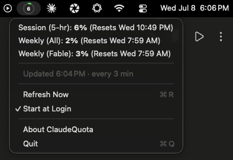
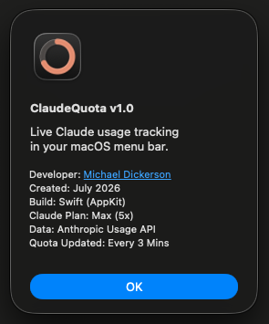

# ClaudeQuota

**Live Claude usage tracking in your macOS menu bar.**

ClaudeQuota is a tiny native macOS menu bar app that shows your Claude plan usage limits at a glance — the same numbers as claude.ai → Settings → Usage — without keeping a browser tab open. A color-coded ring gauge sits in your menu bar with your current 5-hour session percentage inside it; click it for the full breakdown.

<p align="center">
  
  &nbsp;&nbsp;
  
</p>

## Features

- **Ring gauge in the menu bar** — session usage % inside a progress ring; green → orange (≥75%) → red (≥90%)
- **Full breakdown on click** — 5-hour session, weekly (all models), and model-specific weekly limits, each with reset times
- **Live plan detection** — About panel shows your current plan (Pro, Max 5x, …)
- **Extra Usage support** — if you enable Anthropic's paid overage credits, a monthly credits row appears automatically
- **Notifications** — one-time alerts when session usage crosses 80% and 95%
- **Auto-refresh every 3 minutes** — with automatic backoff if Anthropic rate-limits, and a "last updated" line so staleness is always visible
- **Works with any Claude account** — sign in from the menu bar with your Claude credentials (browser OAuth), or let it connect automatically if Claude Code is installed
- **Start at Login**, no Dock icon, zero dependencies — one Swift file

## Requirements

- macOS 13 (Ventura) or later
- A Claude subscription (Pro or Max) — [Claude Code](https://claude.com/claude-code) is **optional**: if it's installed and logged in, ClaudeQuota connects silently from its credentials; if not, use **Sign in to Claude…** in the menu
- Xcode Command Line Tools (`xcode-select --install`) to build

## Install

```sh
git clone https://github.com/Dickie2306/ClaudeQuota.git
cd ClaudeQuota
./build.sh
open /Applications/ClaudeQuota.app
```

**First launch, with Claude Code installed:** macOS asks for permission to read the "Claude Code-credentials" Keychain item — click **Always Allow** and ClaudeQuota connects on its own.

**First launch, without Claude Code:** the menu bar shows **◔ Sign in** — click it, choose **Sign in to Claude…**, and approve in the browser (the consent page says "Claude Code" because ClaudeQuota authenticates with the same public OAuth client the CLI uses). The tab confirms "ClaudeQuota is signed in ✓" and the gauge appears within seconds.

Then click the gauge → **Start at Login**.

### Optional: stop Keychain re-prompts across rebuilds

macOS ties Keychain permissions to the app's code signature. `build.sh` signs ad-hoc by default, which changes every rebuild — fine if you build once. If you plan to rebuild often, create a self-signed code-signing certificate named `ClaudeQuota Dev` in your login keychain (Keychain Access → Certificate Assistant → Create a Certificate → Certificate Type: Code Signing); `build.sh` picks it up automatically and your Keychain approval survives rebuilds.

## How it works

- **Own credentials, own Keychain item**: ClaudeQuota keeps its OAuth tokens in its own Keychain item (`"ClaudeQuota-credentials"`) and refreshes them itself — a self-sustaining chain, seeded either by browser sign-in or (if present) a one-time read of Claude Code's credentials.
- **Strictly read-only toward Claude Code**: it never writes, modifies, or refreshes the `"Claude Code-credentials"` item. Writing to it would reset its Keychain permissions and cause repeated password prompts for Claude Code itself. It's only *read* to seed or recover, so Keychain prompts are one-time events, not recurring ones.
- If the network drops or a token refresh fails, the gauge greys out and holds the last known data with an "as of" note — windows whose reset time has passed are shown as 0% locally — and it recovers automatically on a later poll. **Sign Out…** in the menu deletes the app's stored credentials.
- Polls `https://api.anthropic.com/api/oauth/usage` — the endpoint behind Claude Code's `/usage` command — every 3 minutes, backing off exponentially on HTTP 429.
- Everything runs locally; your credentials never leave your Mac or go anywhere except Anthropic's own API.

> **Note:** the usage endpoint is undocumented and could change. The app fails soft (shows ⚠︎ with last known data). If it breaks, check `parseWindows` in `Sources/main.swift` against the current response shape.

## Customize

Constants at the top of `Sources/main.swift` (`Config`): poll interval, color thresholds, notification thresholds. The app icon is generated programmatically — tweak `Assets/makeicon.swift` and run `Assets/makeicon.sh`. Rebuild with `./build.sh`.

## Uninstall

1. Menu → **Start at Login** (toggle off), then **Quit**
2. `rm -rf /Applications/ClaudeQuota.app`

## Disclaimer

ClaudeQuota is an unofficial, personal-use tool and is not affiliated with or endorsed by Anthropic. It uses an undocumented API that may change or stop working at any time. Use at your own risk.

## License

[MIT](LICENSE) — © 2026 Michael Dickerson. Built with [Claude Code](https://claude.com/claude-code).
